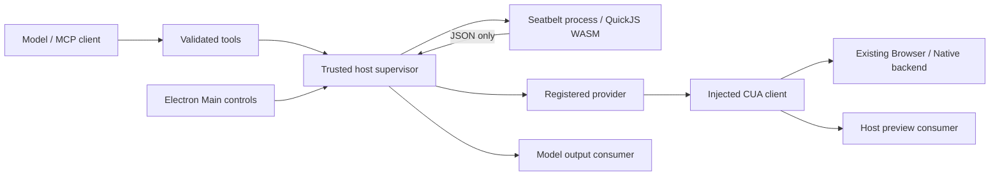
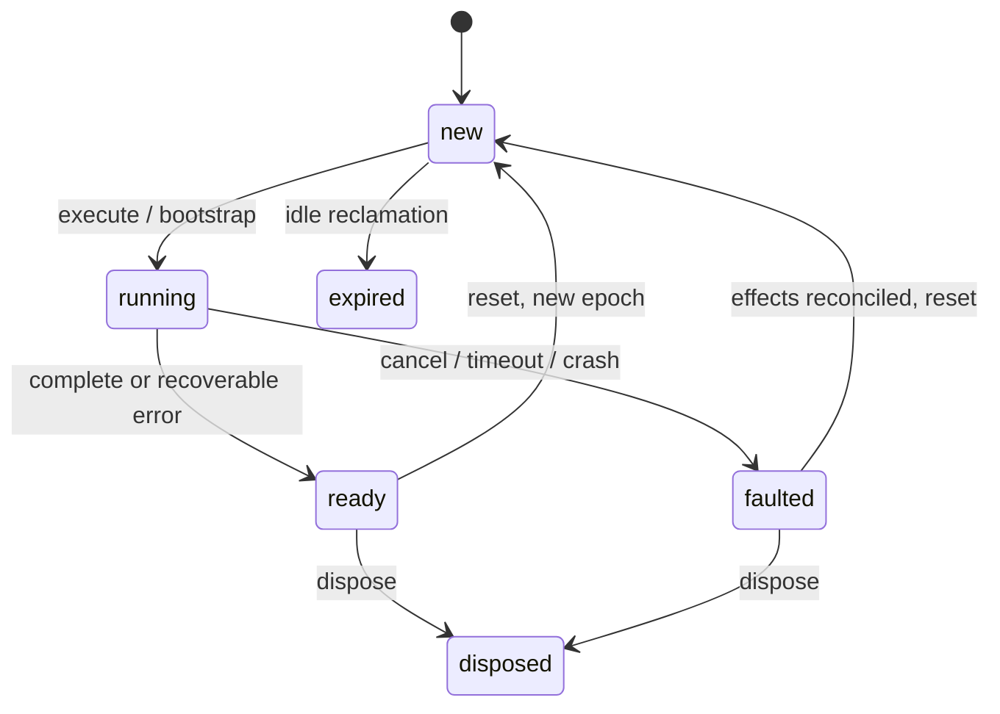

# Technical design — 0.2.0

## Boundaries and version set

Core/supervisor/SDK: `@superche/persistent-repl@0.2.0`. Semantics: `cell-scope/1.0.0`. Schema: `1.0.0`. Engine: `quickjs-emscripten@0.32.0`, pinned WASM artifact and dependencies in `npm-shrinkwrap.json`. CUA fixture contract: `synthetic-cua/1.0.0`. MCP SDK: `1.30.0`; tested negotiation: `2025-11-25`. Electron development fixture: `44.3.0`.

The kernel receives no host object or credential reference. JSON bridge callbacks exist outside the WASM heap, and receive strings only. The host chooses the session and immutable method/schema snapshot; the guest cannot select another trusted session. A session reference is checked by object identity. Resource references are generated by the host and scoped to its session/epoch. The core imports no CUA module.

## Cell compiler

Babel parses the entire cell before execution. Static imports and exports in cells are rejected with actionable messages; dynamic import accepts registered module names only. There is no string replacement of JavaScript semantics. Each cell becomes a strict function with fresh inherited scalar bindings and shared object references. `try/finally` commits readable lexical getters; TDZ getters do not replace prior values. Hoisted `var` and function declarations additionally require an executed declaration or instrumented assignment/use. Same-cell const and lexical duplicate errors remain language errors. Cross-cell const compatibility warnings are compile-time findings, never proof of an executed write.

Async functions are transformed to use the kernel's tracked Promise implementation. Callbacks keep their originating execution identity; a callback cannot obtain a newer cell/turn's permissions. Facades and registered modules pass through the async transformation too. No guest timers are installed. Long-lived external waits are explicit, deadline-bound host resources.

The supported baseline includes expressions, loops, conditionals, function/class declarations, destructuring, async/await, generators, Promise, Map/Set and typed arrays. `eval`, dynamic Function constructors, Proxy, arbitrary global mutation, guest timer APIs, Node built-ins and static cell import/export are deliberately unavailable. This restricted host environment is documented; it is not a full Node project runner. Source maps translate current and retained closure frames to the originating execution and user lines. Maps are bounded by the session call history.

`output`, `services`, `console`, `globalThis`, `eval`, `Proxy`, active facade names (e.g. `cua`) and the `__repl` identifier prefix are reserved. Per-cell locals/helpers are not persisted as public bindings. Bootstrap runs once per epoch; `ready` is not reported before it succeeds.

## Lifecycle

A terminal result is submitted once. Output has monotonic per-execution sequence numbers and stable item IDs. Late frames are checked against child identity, epoch and execution. Default same-session concurrency is `busy`; different sessions execute independently. Deduplication uses trusted call keys. Expired entries refuse replay; a bounded full history refuses new calls instead of evicting keys and allowing old effects to run again.

Unknown dispatched effects are not inferred away from a caught exception, successful cell, closed socket or killed process. `reconcile(session, 'confirmed')` is a host-only operation after backend verification. Reset refuses a running cell or unknown external state. Reset is lazy and reports a new epoch in `new`, not a fabricated ready kernel.

## Budgets and isolation

`DEFAULT_POLICY` defines every public budget. Defaults match the proposed code/output/cell/image/call counts in the requirements: 64 KiB code, 128 KiB non-image output, 4 PNGs up to 5 MiB/16M pixels, 256 RPCs, 64 pending RPCs, 256 handles, 60 s default/120 s maximum wall deadline. Startup, approval, RPC, drain, consumer and cleanup deadlines are separate. Handle expiry invokes cleanup. Slow output consumers cannot hold the execution terminal hostage; final output remains available for item-ID deduplication.

QuickJS allocation limit: 64 MiB. Node old-space ceiling: 128 MiB. A supervisor samples process RSS every 200 ms and terminates above a 256 MiB threshold. **RSS is a watchdog threshold, not an OS-enforced instantaneous hard cap.** This distinction remains a P0 review item; we do not label it a proven hard RSS boundary. macOS Seatbelt denies network, process creation, arbitrary file data access and writes; runtime/bundle/system library reads and root-directory metadata are allowed for dynamic loader startup. `mach-lookup` remains broad for runtime initialization and needs product-profile tightening.

Module source is supplied as text by the trusted host, with name/version/license/kind. There is no guest path resolution or filesystem module loader, so paths, URL imports and symlinks cannot expand access. Package modules cache in the epoch; workspace `next-cell` modules receive a new identity. Old references remain old. The epoch/config snapshot is immutable. There is no live module-source update API; a new registration revision uses a new session.

## Output and privacy

Serialization uses descriptors and tagged values, never getters/toJSON. Cycles are references; undefined/BigInt/Error/Map/Set/TypedArray have defined tags. Depth/item/string truncation is bounded. PNGs are fully decoded with CRC checking after dimension/size validation. Model-provided image metadata is task data and cannot authorize a CUA coordinate operation; the client validates target/image/observation/digest plus a separate trusted model acknowledgement.

Only terminal metadata is sent to the diagnostic hook: correlation IDs, stage, code and duration. The component writes no code, variable, screenshot or DOM log. Host output callbacks are task data: the embedding product owns their retention policy. Kernel stderr is discarded to avoid leaking generated source/paths. Fixture examples intentionally print synthetic results.

## Design references

- [QuickJS embedding implementation and API](https://github.com/justjake/quickjs-emscripten)
- [Node: VM contexts are not a security mechanism](https://nodejs.org/api/vm.html)
- [MCP tools, fixed 2025-11-25 contract](https://modelcontextprotocol.io/specification/2025-11-25/server/tools)
- [MCP cancellation semantics](https://modelcontextprotocol.io/specification/2025-11-25/basic/utilities/cancellation)

These public sources informed the design; they do not establish this package's acceptance results.

Async generators are explicitly rejected before execution; use async functions and registered event/wait resources. Guest timers are not exposed. All ordinary unawaited RPC callback chains drain within the cell budget, and delayed unhandled rejections are reported in the original terminal.
