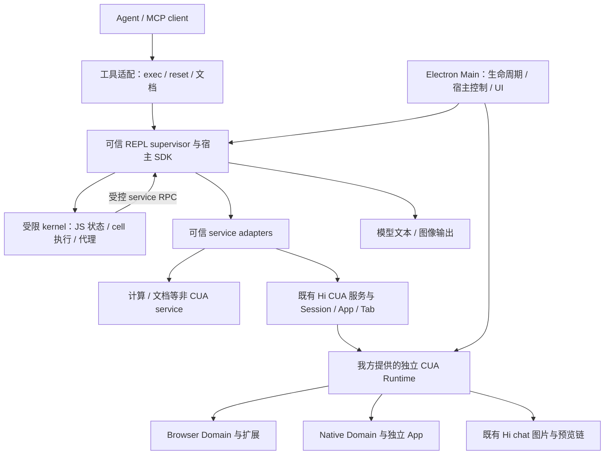
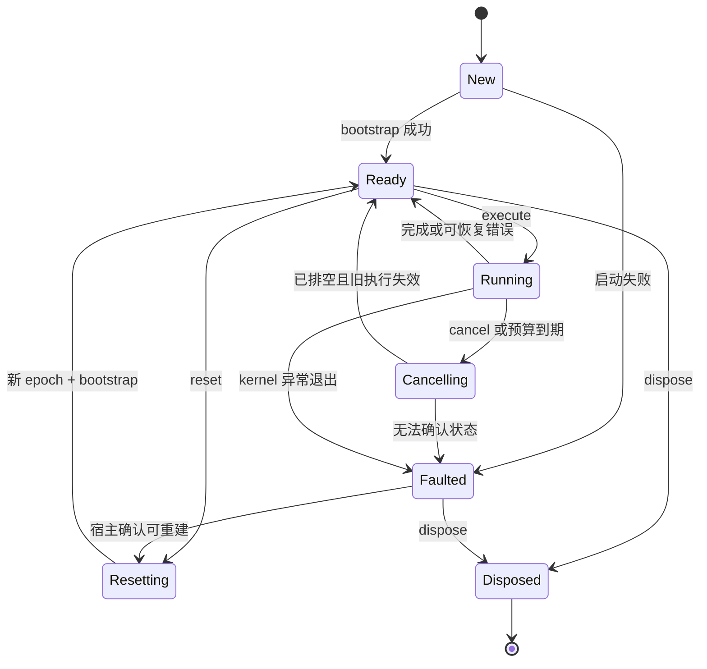

# 通用持久 REPL 组件及 CUA 接入 · 对外交付需求

版本：1.0 · 日期：2026-09-10 · Status: Proposed（需求方交付给实现方的规格）

需求方：Hi 产品 / Agent 能力团队，以下简称“我方”。实现方：接收本文并交付组件的团队或开发者，以下简称“交付方”。具体接口人、时间和商业安排另行约定。

确认范围：**通用 REPL 组件＋CUA 接入能力**。本文是我方向交付方提出的需求，不是已有代码的维护交接。交付方没有我方现有 `node:repl`、CLI、Runtime 或模型桥代码；本文不以取得这些源码为前提，也不要求交付方改造我方仓库。正文可独立发送。实现语言、最终包名、资源阈值等尚未确定的内容标为 Proposed。

## 1. 交接摘要

要交付一个可以嵌入 Agent / Electron 产品的持久 JavaScript 执行组件：Agent 分多次提交代码，跨调用保留变量、函数、对象和异步资源引用，通过受信任服务调用外部能力，并将文本、结构化值、图片和执行状态返回模型及宿主。

首个业务适配为 Computer Use / Browser Use，简称 CUA。Agent 可以在第一段代码获取 App / Tab 对象，随后连续操作、观察、切换目标，再回到原对象继续工作。**通用组件不实现 Browser / Native 底层动作，不建设设备 Runtime，也不承担整个 Agent 调度。** 我方提供底层能力服务及其正式接入说明，交付方通过本文定义的接口接入。

交付方应交付：可复用的 REPL core / supervisor、宿主 SDK、MCP 适配、版本匹配的开发与模型使用文档、CUA 适配接口及实现、独立样例、部署和回退说明、可复现的分层验收结果。无需先拥有我方代码或聊天历史。

### 已确定的产品方向

- 同一 REPL session 内跨 cell 保留状态；普通错误后能继续修正代码。
- 面向模型提供短小的 JS 工具入口和按需文档，支持确定性批处理。
- 模型代码、可信能力适配、设备执行器分别承担各自职责。
- 通用 core 可脱离 CUA 独立运行；CUA 代码入口调用我方提供的能力服务，与动作 Tool 使用相同后端。
- 支持文本、结构化值和图片；图片给模型与图片在 Hi chat 中显示是两条交付链。
- 明确区分 cell cancel、kernel reset、外部任务 stop、session dispose；不得把解释器清空当作 OS 操作撤销。
- 首版落地 macOS Electron 与现有 Hi Browser / Native 后端。Windows/Linux 不计入首版验收。

### 成功标准

交付方能够用同一组件完成两组独立演示：一组与 CUA 无关的计算及合成 service 调用；一组基于配套 CUA 测试后端完成 Browser → Native → 原 Browser 的连续任务。随后由双方在我方提供的真实模型 / 设备环境联合验收。必须证明跨 cell 保持对象、错误后可恢复、停止有效、结果有对应后观察；不能只演示一段计算或一次 `tools/list`。

## 2. 为什么需要这项能力

逐个动作 Tool 要反复传递目标、状态和中间结果；一次性脚本又难以保留函数、代理对象和等待资源。持久 REPL 将一段可预测的操作交给代码完成，把需要判断的步骤留给模型。

典型交互是：先发现并绑定目标 → 看首次状态 → 执行确定的一组操作 → 返回新状态 → 模型决定下一段代码。它不等于一次执行整项任务，也不意味着模型可以依据未返回的新图片继续猜坐标。

性能收益应通过同一任务的调用次数、时间和最终效果测量。本文不承诺固定百分比的 token 或时延下降。

## 3. 对齐目标、术语与实现自由度

对齐目标是 Codex 式“可连续编程的 Agent 工具体验”：持久绑定、top-level await、可恢复的 cell 错误、受信任服务调用，以及受控的多模态输出。验收以本文的行为定义为准，不以“看起来像 Codex”作为模糊标准。

| 术语 | 本文定义 |
| --- | --- |
| Host / 宿主 | 嵌入组件的应用或 CLI，掌握真实用户、任务、权限与生命周期 |
| REPL session | 一份隔离的持久执行环境；不是聊天记录，也不是 CUA 控制会话 |
| Cell | 一次提交的 JavaScript 代码及其执行/输出作用域 |
| Kernel / epoch | 执行代码的环境及其代次；reset/restart 后产生新代次 |
| Supervisor | 可信执行监督者，负责进程、预算、RPC 校验、取消和结果 |
| Service / Provider | 宿主登记的外部能力及其适配接口；实现方不必知道其内部源码 |
| CUA target | 可控制的 App / Tab 资源，由底层能力服务确认身份和权限 |
| Observation | 某个 target 在某次观察中的状态及版本；变量持久不等于观察一直有效 |
| Effect / outcome | 外部操作实际影响或其已知程度；与 JS 执行完成、动作 ACK 不同 |

我方已有本机 Codex 实现调研，确认过 Node VM、AST 解析与 ESM cell 接续这条参考路线。但 **不要求使用 Rust、Meriyah、自定义 Node kernel 或任何指定仓库**，也不向交付方提供 Codex 私有源码。交付方可以独立实现或使用有适当授权的开源组件，只要满足本文的功能、安全、许可与验收要求。

具体行为差异（例如第 6 节的闭包）已经在本文给出例子，无需交付方反向工程 Codex 才能理解要求。

## 4. 范围、优先级与非目标

| 阶段 | 必须交付 | 完成定义 |
| --- | --- | --- |
| P0：首版完整交接范围 | 持久 JS 语义、受限执行、可信服务注册、宿主 SDK / MCP、文本与结构化输出、图片、生命周期、诊断、CUA 接口/适配/联合接入 | 第 12 节 P0 用例全部满足或明确记录经确认的范围变更；独立交付与我方环境联合验收分别报告 |
| P1：后续增强 | 音频、受控文件 artifact、可选长调用 yield/wait、更多可配置模块、资源压力优化 | 独立计划，不能混入 P0 已完成声明 |
| 不在本需求内 | Agent 规划器、任务平台、Notebook 编辑器、自动 npm 安装、任意 shell / 网络 / 文件访问、跨设备媒体服务、JS 内存快照迁移、生产 Windows/Linux | 不以“通用化”为由附带建设 |

P0 必须具备多个独立 session 的隔离能力；不要求新的多租户云服务。包可以由 Electron 随应用分发，也可由 CLI/MCP 启动；kernel 不新增为用户必须手工安装的产品。交付方提供独立可运行的分发包，我方决定最终产品中的打包位置。

## 5. 用户场景与职责边界

| 使用者 | 场景 | 预期结果 |
| --- | --- | --- |
| Agent | 多次提交代码，复用变量、函数、App / Tab 对象 | 无需每次重新初始化，不因换域丢失原对象 |
| Agent | 一次调用完成确定性操作并输出状态 | 输出完整关联到本 cell；下一步判断使用新观察 |
| Agent | 某个 API 报错，读取原错误与新状态后调整 | 保留已有可用绑定，不自动重放外部操作 |
| 宿主开发者 | 注入非 CUA 的受控 service | 不修改 core 即可提供代理、文档、结果与撤销能力 |
| 用户 | 运行中停止，或切换会话 / 权限 | 控制入口不被死循环卡住；旧回调不能继续取得权限 |
| 运维 / 集成开发者 | 判断失败在哪一层，复现问题 | 能定位 session / cell / RPC / runtime 版本及阶段，日志不带用户内容 |



图中的 Host、Kernel、工具适配和服务接口由交付方提供；我方提供 CUA 底层及产品 Main / 模型桥 / 图片 UI。职责可以合并到合理的模块和进程，不要求每个方框都是一个新进程。强约束是模型代码不在 Electron Main / renderer 或可信 service 执行上下文中运行；CUA 后端不迁入 REPL 组件。

本地 Agent 使用嵌入 SDK 或 stdio MCP；云端 Agent 通过产品既有认证通道进入本地宿主。设备凭据和 target 权限留在本地，模型不得自行提供可信 owner 或 native socket 地址。

## 6. 通用 REPL 功能需求

以下 R 编号是需求与验收的稳定索引。`repl`、`output`、`services` 等名称是接口语义示意，最终命名在技术设计中统一；公共契约不依赖我方内部接口名称。

### R01 · Session 与执行入口（P0）

宿主 SDK 必须提供 create / execute / status / cancel / reset / dispose 的等价能力。MCP 至少暴露 exec、reset 和文档入口；status / cancel 可以由宿主控制面提供，但在 cell 运行时也必须可用。

- 每个 session 有稳定 ID、宿主所有者、workspace scope、kernel epoch、语义版本和能力配置版本。
- session 由可信宿主绑定到产品任务；模型调用不能指定其他用户 / 任务的 session ID 来越权。
- 默认惰性启动 kernel；纯计算和阅读文档不启动 CUA Runtime 或获取桌面权限。
- 同一 session 跨工具调用保留状态；跨 Agent turn 保留内存与否由宿主 session 生命周期决定，并明确告知模型。新 turn 的能力授权必须重新验证。
- 不同 session 的变量、模块状态、输出、pending RPC 和资源引用不能串用。产品任务恢复或进程重启后默认创建新 epoch，不宣称恢复原 JS 堆。
- 宿主配置最大 session 数、空闲回收策略及资源保留期限；回收产生明确失效状态，不偷偷新建一份空环境冒充原 session。

### R02 · JavaScript 与持久状态（P0）

必须支持表达式、语句、循环、条件、函数、async/await、class、解构、Promise、Map/Set、TypedArray 等所选 ECMAScript 基线能力；精确 Node / 引擎版本随包声明。

- 支持 top-level await，不要求模型手工套 async IIFE。
- 顶层变量、函数及对象引用跨 cell 可复用；对象保留身份，不以每次 JSON 序列化重建代替。
- 代理对象和函数留在 kernel 内；跨可信服务只传经验证的结构化消息 / 不透明资源引用。
- 一个 cell 内维持标准块级作用域与初始化规则。未支持的语法在执行前给出具体错误，不能用字符串替换静默改变代码意义。

### R03 · 声明、重声明与闭包（P0）

目标语义版本采用 **Codex-style cell scope**：每个 cell 有自己的词法绑定，后续 cell 可重新声明同名顶层变量，读到最近完成建立的绑定。这里是本需求选择的可测契约，不要求复用 Codex 实现代码。

```js
// cell 1
let count = 1;
let box = { value: 1 };
function readOldCount() { return count; }
function readSharedBox() { return box.value; }

// cell 2
count = 2;
box.value = 2;
output.value([count, readOldCount(), readSharedBox()]);
// 目标输出：[2, 1, 2]
```

旧函数保留创建时 cell 的词法环境；共享对象的原地修改仍可见。不能让模型误以为所有旧闭包都会自动读取最新 cell 的标量绑定。

- 支持 `var/let/const`、function/class 及解构绑定的跨 cell 复用和合法重声明。
- 同一 cell 内的重复词法声明、const 再赋值仍按语言规则报错。
- 跨 cell 对原 const 重新声明允许。后续 cell 中对承接的 const 直接赋值允许，更新该 cell 的局部绑定并返回 `CONST_REASSIGN_COMPAT` warning，指导使用 let；旧 cell 闭包中的绑定不随之变化。同样覆盖赋值、复合赋值、自增/自减及解构赋值。警告可以在编译时产生，但必须标明它不是“赋值语句已经执行”的证明。
- 引擎内部标记、宿主对象不可被模型通过顶层重声明替换；保留名称必须在文档中列出。
- 发布包必须声明这一语义版本；不要求交付方支持或维护我方旧解释器的行为。若提出另一种更简单的语义，需要先提交差异及示例，由双方确认，不能隐式替换。

### R04 · 失败后的绑定和副作用（P0）

- 语法 / 链接错误不执行用户代码，保留上一有效状态。
- 运行时错误前已完成初始化的绑定可继续使用；未初始化的声明不能在后续 cell 变成“幽灵变量”。
- 同名新声明初始化失败时保留此前有效绑定；解构部分初始化、var 提升和函数声明须分别测试。
- 已发生的对象修改、service 调用及 OS 效果不做隐式回滚，也不重新执行历史 cell 来“恢复环境”。
- 返回值至少说明本次错误、epoch 是否变化、绑定是否保留、外部调用完成状态是否已知。无法确认时明确 unknown。

```js
// cell 1
let keep = { n: 1 };
let before = 10;

// cell 2：失败前的进度保留
keep.n = 2;
let ready = 3;
throw new Error("synthetic failure");
let unreachable = 4;

// cell 3：目标行为
output.value([keep.n, before, ready]); // [2, 10, 3]
// unreachable 不应成为可用的新绑定
```

以下是必须覆盖的补充行为。每行使用独立 session，并先执行 `let old = 10; function fail() { throw new Error("fixture"); }`；表中均为合成代码。

| 被测 cell | 下一个 cell 的预期 |
| --- | --- |
| `let old = fail();` | old 仍为 10 |
| `let [a, b = fail()] = [1, undefined];` | a 为 1；b 不成为新绑定 |
| `throw new Error("fixture"); var v = 1; function later() { return 1; }` | v/later 不因提升成为后续 cell 的新绑定 |
| `v = 4; throw new Error("fixture"); var v;` | v 为 4，已执行的有效赋值保留 |
| `var v; throw new Error("fixture");` | v 存在且为 undefined，声明点已经执行 |

直接访问不存在的新绑定应得到 ReferenceError；不能仅用 `typeof` 的 undefined 证明绑定不存在。函数声明在同一 cell 内仍按 JS 提升规则可用；是否带到后续 cell 按已执行的声明或有效使用记录处理。上述可测行为与正常 JS cell 内语义必须同时成立。

### R05 · 模块与依赖（P0）

- 支持 `await import(specifier)` 加载宿主登记的模块。顶层静态 import 首版可明确拒绝并提示动态 import，不伪称完整 Node 工程执行器。
- 依赖目录、版本、允许的内置模块、可读取的本地代码根均由宿主登记；模型不能通过任意路径、符号链接或依赖链扩大范围。
- 同一次 session 中包依赖按固定版本缓存；允许的 workspace 代码模块支持明确的 reload / 下一 cell 重新加载策略，并说明旧引用仍可能指向旧模块。
- 配置更新只在受控生命周期边界生效；不得运行中替换可信 handler。新配置需要新 revision，必要时 reset / 新 session。
- 安装依赖属于独立宿主操作，不在 import 失败后自动联网 npm install。
- 对外提供模块来源与版本清单、许可证信息；不提供凭据和任意绝对路径枚举。

### R06 · 初始化、全局对象与文档（P0）

- 宿主通过受控 bootstrap 注入输出 helpers、service proxy 和领域 facade。每个 epoch 初始化一次；失败不能将半初始化环境标 ready。
- 文档分为基础语言与生命周期说明、当前启用 service 的概要、按需方法说明；首次初始化不倾倒全部 CUA API。
- 文档与实际 schema / capability revision 一致；不支持的能力返回明确原因。
- 通用 API 使用产品自己的名字；只有确有行为覆盖时才提供 `nodeRepl.*` 兼容别名，不冒充全量兼容。

### R07 · 可信 service 注册与调用（P0）

宿主必须能注册一个与 CUA 无关的 service，提供名称、版本、方法 schema、执行 handler、权限 / 目标验证、资源回收和可选文档。core 不导入 `hi-cua`、浏览器或 Native 实现。

- 每次 RPC 带 session / epoch / cell / rpc 关联；可信 owner、turn、权限上下文由宿主在最终派发前附加，不能从模型参数采信。
- 只派发已登记的方法，校验参数、大小与能力 revision；非法 / 过期 / 重复请求不得产生新的外部写入。
- service 出错保留 code、message、stage、原始领域回执和 recoverability；不吞成统一的“JS 执行失败”。
- 返回的可调用资源由宿主管理不透明引用。模型可持有代理，但不能伪造 / 转移授权。普通 JSON 数据不假装是可信 resource。
- handler 缓存与可撤销能力分开：缓存对象存在不代表原权限仍有效。

### R08 · 授权与可信宿主上下文（P0）

- 通用组件提供 approval hook，具体风险和确认 UI 归宿主 / service。CUA 继续使用既有产品权限、目标范围和用户停止。
- 权限快照、目标、参数在确认前后保持一致；确认后重新检查关键 revision，不能在等待期间换目标。
- decline / cancel / timeout 均不能落入默认允许。已有有效授权可复用，不要求每次无条件弹窗。
- tool annotation、模型 prompt、运行时对象名称都不是可信授权来源。
- 配置收紧、用户切换或宿主撤销立即阻止后续能力派发；是否保留纯计算内存必须明示，不能偷偷沿用旧能力。

### R09 · 异步、计时器与跨 cell 等待资源（P0）

- cell 执行期间的 RPC / 输出必须关联原 cell；晚到响应不得落到下一 cell。
- 普通未 await 的外部能力调用不能被遗忘：cell 完成前有界 drain，超出预算时返回 pending/unknown 并进入相应取消或回收流程。
- 后台事件资源必须显式登记为 session/target/deadline 所属的 resource；允许 `waitForEvent` 返回句柄，在后续 cell 取值。cell 完成不自动销毁这类已登记等待。
- 计时器、Promise rejection 和事件回调有明确归属与清理规则；不得让旧 cell 的任意回调借用新 turn 权限执行动作。
- 未捕获异常或无法归属的异步故障导致 kernel 退出时，宿主返回可诊断错误、新 epoch / 失效状态，不进行静默重放。

### R10 · 顺序、并发与阻塞（P0）

- 同一 session 默认一个执行中的 cell；重复 execute 明确返回 busy，不隐式排成长队。不同 session 可以各自运行。
- status、cancel、stop 等控制面不等待 cell 大锁，死循环也必须能停止。
- 同一 cell 可组合独立读操作，但 service / Domain 决定实际并发；不把 `Promise.all` 等同于两个 UI 写操作可以并发。
- 事件等待先 arm 并取得登记确认，再执行触发动作；等待的整个生命期不占用 mutation 锁。
- 旧 cell/epoch 的消息只可用于其自己的终态或清理，不得修改新一轮绑定和输出。

### R11 · 取消、超时与异常退出（P0）

- 区分启动、JS 执行、service 调用、等待授权、清理等预算。总 wall deadline 有上限；暂停计算计时不等于取消外部 deadline。
- cancel 先禁止新能力调用，再通知可取消的在途调用；必要时终止 kernel。必须返回哪些调用已终止、哪些结果未知。
- 纯计算超时 / 内存超限可更换 kernel，不必无依据撤销所有外部目标；在途外部操作需要先阻止继续输入并核对释放状态。
- 杀进程、超时、socket 关闭、Promise reject 都不能被包装成“外部动作已撤销”。没有反证时保留 unknown，不自动重试。
- 宿主崩溃、EOF、进程退出均进入统一清理策略。宿主不能确认释放时保持阻断状态，不能假定重新启动即安全继续。

### R12 · Reset 与 Dispose（P0）

通用 `reset` 清空变量、模块实例缓存、未取值的旧 kernel 资源及文档注入状态，创建新 epoch。它不关闭用户 App / Tab，也不重新执行 bootstrap 以外的旧代码。

- 运行中 reset 返回 busy；调用者先 cancel，再在没有未知在途写操作的边界 reset。宿主控制面允许封装这两步，但要分别给出结果。
- reset 撤销旧代理和等待资源；外部 CUA 控制租约可按宿主策略保留，但新 kernel 必须重新获得代理并核验目标 / 观察有效性，不重复弹出无必要授权。
- dispose 结束 REPL session，阻止重用，触发已登记资源清理；不与 `finish` 页面保留策略混淆。
- CUA `stop` 是外部控制任务的结束 / 紧急停止；正常 finish 可以按已有保留标记清理自建页，紧急 stop 不顺便执行额外关闭动作。

### R13 · 文本、值与错误输出（P0）

- 提供 `output.text` / `output.value` 的等价显式输出；console.log/warn/error 进入受控输出，不写入协议 stdout。
- 普通值、undefined、BigInt、循环引用、Error、Map/Set、TypedArray 都有确定的表示或明确错误；序列化不得任意执行 getter / 用户 toJSON 来取得可信结构。
- 保留输出顺序与 item identity；循环、大对象、深对象有深度 / 大小上限，截断有原因和计数。
- 返回值展示策略明确：显式输出为主；若展示最后表达式，不能重复输出同一份显式结果，也不能为展示重新求值。
- 区分执行终态与外部调用结果：代码 catch 了 service 错误可以完成，但原失败 / unknown 回执仍保留，不能由 catch 自动变成任务成功。
- 错误带源 cell、行列、阶段和可继续动作；实现若改写源码，需要将位置映射回用户代码，不能只给内嵌生成文件行号。

### R14 · 图片、流式结果与消费者（P0）

- 通用组件可输出有效图片 bytes + MIME 或宿主登记的 image artifact；校验格式、尺寸和大小，不为取图自动访问任意 URL / 文件。
- CUA 图像代理保留原目标 / observation / image identity；修改 bytes、转用旧 observation 或另一个目标必须由现有服务拒绝。
- 输出可以边运行边发给支持流的宿主；MCP 客户端不支持时有界收集为最终 content，不能冒充模型中途已经看过图。
- 慢消费者、断连和背压有界处理；可丢弃展示帧但不得丢弃最终错误 / 已执行动作回执。截断不反向改变执行结果。
- 图片进入模型 context 与 Hi chat/PiP 显示分别验收；模型 code 输出不直接获得任意 chat 写权限。
- 音频 / 通用文件 artifact 为 P1；若未开启，capabilities 与文档明确不支持，不能返回假成功。

### R15 · 执行隔离和资源预算（P0）

- 模型 JS 运行在可单独终止的受限进程；仅使用 `node:vm` context 不满足安全隔离要求。[Node 官方文档](https://nodejs.org/api/vm.html#vm-executing-javascript)明确 VM context 不是安全机制。
- 不提供默认 unrestricted fs / network / shell、宿主凭据、真实 process.env、任意 IPC 或原生指针。注册 service 是外部能力入口；扩大能力必须由宿主配置和授权完成。
- 限制 CPU 时间、进程 RSS/堆、代码长度、输入帧、输出、RPC 数量、pending 数量、资源句柄和 session 数。V8 heap 限制不能代替包含 Buffer/native allocation 的进程内存约束。
- 格式错误 / 超大帧在派发前拒绝；记录拒绝阶段，不能为解析错误吞掉已经发生的另一个操作的 unknown 回执。
- 安全测试覆盖导入、路径穿越/符号链接、原型污染、消息伪造、旧句柄、未 await 与无限循环；禁止只靠模型提示限制。

### R16 · 可观测性、隐私与版本（P0）

- 日志只保存必要元数据：关联 ID、版本、阶段、耗时、队列/预算、错误类别、kernel 重置原因、外部调用完成性。默认不保存代码、变量值、截图、AX/DOM、输入文本、剪贴板、Cookie、Token。
- 文本 / 图片输出是任务数据，不自动写入新的持久日志。若宿主已有会话保存政策，必须在数据边界中声明；组件不额外复制一份。
- 源码诊断不得把内部 bootstrap、敏感路径或请求参数泄漏给模型。用于排障的合成 fixture 必须标记。
- 包清单包含 core/engine/adapter/semantics/schema 版本、构建输入和许可证；行为与文档同步交付。
- 只凭 ready、工具目录、构建或版本匹配不能标记 CUA 任务完成。

## 7. 最小宿主接口与结果契约

以下是供设计对齐的逻辑接口草案，不是我方已有源码，也不强制 JSON wire 或所有字段直接暴露给模型。交付方须补全并交付可编译的公开类型、schema 和可运行示例；我方按这些公共接口集成，不依赖交付方内部模块。接口名可调整，所表达的职责必须覆盖。

### 7.1 宿主 SDK

```ts
interface ReplHost {
  create(config: TrustedSessionConfig): Promise<SessionRef>;
  execute(session: SessionRef, input: ExecInput, context: TrustedCallContext): Promise<ExecResult | ExecRejected>;
  status(session: SessionRef): Promise<SessionStatus>;
  cancel(session: SessionRef, executionId: string): Promise<CancelResult>;
  reset(session: SessionRef): Promise<ResetResult>;
  dispose(session: SessionRef): Promise<DisposeResult>;
}

type ExecInput = {
  code: string;
  timeoutMs?: number; // 整个 cell 的 wall deadline，包含 service 与授权等待
  title?: string;
  // 身份、call ID、权限等由宿主传入受信任上下文，不从模型代码采信。
};

type TrustedCallContext = {
  ownerKey: string;        // 仅我方宿主可构造的身份索引；不是模型自报身份
  taskKey: string;
  turnKey: string;
  callKey: string;         // 宿主生成的去重关联键，与 MCP request ID 分层
  authorizationRevision: string;
  signal: AbortSignal;
};

type TrustedSessionConfig = {
  ownerKey: string;
  taskKey: string;
  workspaceScopeKey?: string; // 默认不因此开放文件访问
  semanticsVersion: string;
  capabilityRevision: string;
  policy: ResourcePolicy;     // 覆盖第 11 节预算及允许的模块
  providers: ServiceProvider[];
  authorize: AuthorizationHook;
  onOutput: (event: OutputEvent) => void | Promise<void>;
};

type ExecResult = {
  accepted: true;
  executionId: string;
  kernelEpoch: string;
  status: 'completed' | 'failed' | 'cancelled' | 'timed_out' | 'crashed';
  output: OutputItem[];
  bindings: 'retained' | 'cleared' | 'unavailable';
  error?: { code: string; message: string; stage: string; line?: number; column?: number };
  warnings: { code: string; message: string; line?: number }[];
  externalCalls: { pending: number; outcome: 'none' | 'known' | 'unknown' };
  receipts: ExternalReceipt[]; // 每个外部动作的派发/效果回执，不含私密原始输入
  diagnostics: { truncated: boolean; durationMs: number; recovery: string[] };
};

type ExecRejected = {
  accepted: false;
  code: string;
  message: string;
  stage: string;
  recovery: string[];
};
```

`ResourcePolicy`、`SessionRef`、状态/清理结果等类型由交付方在设计交付中完整定义，不能以这些占位名作为最终 SDK。session 引用由宿主持有；模型可见的资源 ID 也必须经过真实所有权校验。重复 `callKey` 只可读取原执行结果/状态，不得重执行代码；缓存过期返回 expired/unknown，不承诺外部动作 exactly-once。

| 公共类型 | 必须表达的内容 |
| --- | --- |
| SessionStatus | session/epoch、生命周期状态、当前 execution、是否允许继续、能力 revision、阻断原因 |
| OutputItem / OutputEvent | 类型、itemId、executionId、单调 seq；text/value/image 的载荷或受控引用；截断标记；流与最终输出可按 ID 去重 |
| ExternalReceipt | rpcId、阶段、是否派发（no/yes/unknown）、结果（known/unknown）、原领域错误、后观察关联；不可用执行 completed 推导 effect 成功 |
| CancelResult / DisposeResult | 当前执行是否停止、kernel 是否存活、外部清理 confirmed/pending/unknown、可继续操作 |
| ResetResult | 原 epoch、新 epoch、失效的资源类型、外部状态是否阻断；失败不能谎报创建成功 |

终态只能提交一次。输出中 BigInt、循环对象等使用有标签的安全表示，不能直接作为非法 JSON；MCP 的结构化结果须满足所声明 schema。状态和必要回执有独立的有界保留额度，不能被大量 console 输出挤掉。

### 7.2 Service / Provider 扩展点

交付方提供通用注册 API。我方注册业务 handler；交付方提供其代理生成、调用校验、关联和资源回收机制。

| 扩展点 | 输入 / 输出与职责 |
| --- | --- |
| 注册 provider | name、version、方法名、参数/结果 schema、文档、受信任 handler；只在 host 配置边界登记 |
| 调用方法 | 受验证的参数、TrustedCallContext、session/epoch/cell/rpcId、deadline/signal；返回值、回执或结构化错误 |
| authorize hook | 规范化后的方法、目标、冻结参数、可信上下文；返回 allow/deny 或有期限的授权等待；派发前再次检查撤销状态 |
| 资源登记 | provider 登记 target/waiter 等资源，返回只在其 owner/session/epoch 范围有效的不透明引用；kernel 取得 facade proxy |
| 资源使用/撤销 | 每次调用校验权限和有效期；支持 release、cancel、reset、dispose 清理及未知结果回执 |
| 文档 / 能力发现 | 按 capability revision 输出实际启用的方法、参数、结果、限制、示例；与运行时校验共用契约来源 |

我方不会向 kernel 注入可直达受信任对象的函数引用。即使模型构造出相同 ID 或污染对象原型，也不能跳过上述验证。handler 内部使用 HTTP、IPC 或本地 SDK 由我方能力服务决定；通用 core 不感知该细节。

必须附带不访问真实设备的 `counter/echo` 合成 provider：支持读写计数、延迟响应、显式失败、重复/晚到响应、可取消等待及可模拟的未知结果。它用于独立验收 RPC、权限、取消与隔离，不是生产业务服务。

### 7.3 模型 Tool 与 MCP 链路

建议工具名和最小参数如下；最终交付的名称、schema、模型说明必须一致。

| 工具 | 模型参数 | 必须行为 |
| --- | --- | --- |
| `repl_exec` | code；可选 timeoutMs、title | 绑定当前宿主 session，执行一段 JS，返回输出、终态、错误及外部结果已知程度 |
| `repl_reset` | 无 | 清空当前 kernel，明确变量丢失与新 epoch；运行中拒绝并指向 cancel |
| `repl_docs` | 可选 topic / method | 返回基础使用说明或已启用能力的按需文档，不因此开启设备控制 |

最小调用链必须可演示：`MCP tools/call → Tool 参数校验 → 宿主绑定可信上下文 → supervisor → kernel → service RPC → provider handler → 结果/图片 → Tool content`。模型的 code 字符串不能成为 host 层直接 eval 的对象。直接 SDK 接入经过相同的执行和权限路径。

首版交付 stdio MCP server 和真实 MCP client 的联通样例，完成 initialize、能力/版本协商、tools/list、tools/call、取消及 EOF 清理。按协商版本投影 text/image/structuredContent；Tool 执行错误与协议错误分开。依据 [MCP Tools 规范](https://modelcontextprotocol.io/specification/2025-11-25/server/tools)；引用该固定版本用于设计，交付时须声明实际支持与测试版本。

MCP 的取消通知与宿主 cancel 对接；通知不等于外部操作撤销，也不依赖被取消请求仍能回包来维持控制状态。宿主 status 保留可查询终态，迟到消息按原 execution 收敛。参见 [MCP Cancellation 规范](https://modelcontextprotocol.io/specification/2025-11-25/basic/utilities/cancellation)。

stdio 中 stdout 只输出协议消息，诊断输出也要经过内容过滤。多个 transport 的 session 绑定由宿主配置，不能默认所有客户端共享一份全局 REPL。远程网络接入、设备发现和产品认证通道由我方提供，本次不要求另建公网 MCP 服务。

P1 若增加长调用 ticket/yield/wait，须继续复用 executionId、输出序号和取消接口，不另建通用异步任务平台。

### 7.4 错误与恢复契约

`ExecResult` 表达已接收 cell 的终态；busy、非法输入、无权限等执行前拒绝使用单独的结构化 `ExecRejected` 结果，带 code/stage/recovery，不产生新的执行或副作用。交付方应在最终类型中使用明确的联合类型。错误码可按产品规范命名，但至少覆盖以下语义。

| 错误类别 | 必须行为与恢复依据 |
| --- | --- |
| busy / invalid argument | 第二个 cell 或参数超限在执行前拒绝；原执行继续，由 status/cancel 管理 |
| session disposed / epoch stale / resource expired | 不使用旧对象；返回重新创建或获取引用的指引，不自动重跑旧代码 |
| permission denied / authorization revoked | 禁止新的能力派发；不把拒绝自动升级成关闭用户 App |
| unsupported capability / capability revision changed | 指向匹配文档或能力版本；不转用别的 Domain 代做 |
| syntax / link / runtime exception | 按 R04 返回错误位置与绑定保留状态；允许在可恢复时继续执行 |
| deadline / resource limit / kernel crash | 明确预算或进程阶段、epoch/绑定状态、在途调用及清理结果 |
| observation / coordinate stale | 拒绝使用失效观察；保留真实阶段和派发状态，重新观察后由模型决定后续动作 |
| partial input / unknown outcome | 保留已发生或未知的输入及对应回执，阻止受影响目标继续输入并核对释放；不得自动重试 |

## 8. 生命周期与状态迁移



图只表示 REPL session。外部能力状态独立保存，不由 `Ready` 自动推导授权可用或 CUA 控制有效。

`Cancelling → Ready` 要求原执行失效且有可用 kernel；如 kernel 已被终止，须先完成新 epoch 的 bootstrap 并报告绑定清空。`dispose` 可从任何非 Disposed 状态调用，运行中先执行取消与清理；Disposed 表示 session 不可复用，不表示未知外部效果已经撤销。

| 操作 | JS 状态 | 外部能力与数据 |
| --- | --- | --- |
| 普通 cell 完成 | 保留绑定；关闭本次执行输出作用域 | 已登记等待可按 deadline 保留；动作仍需效果验证 |
| 语法 / 可恢复 API 错误 | 按 R04 保留有效绑定 | 不自动全局 stop；保留原错误和可读新状态 |
| cancel cell | 停止本次代码；必要时丢失 kernel | 阻止新动作，取消/核对在途操作；可能保留 unknown |
| reset kernel | 清空绑定、新 epoch、重建 facade | 不关用户 App/Tab；旧引用失效，重新核验目标 |
| CUA stop | 由 adapter 结束控制；旧代理不可再调用 | 释放输入/控制、停止预览；正常 finish 与紧急 stop 清理不同 |
| dispose session | 不可继续执行 | 撤销关联资源；清理结果明确 confirmed / pending / unknown |
| 新 Agent turn | 可按宿主策略保留内存 | 新可信上下文，旧 turn 回调不可借权，交付身份重新绑定 |
| 宿主 / kernel 重启 | 默认丢失内存，报告新 epoch | 不重放旧代码、不假装旧目标已经重新授权 |

## 9. CUA 适配需求

### R17 · CUA Provider 与持久对象（P0）

交付方提供独立 CUA adapter，将一个由我方实现的 CUA service client 包装为 REPL 可用的 Session / App / Browser / Tab facade。通用 core 不出现 CUA 方法分支。交付方负责对象代理、方法映射、callback、等待和结果适配；我方负责真实 Browser / Native 操作实现。

首版覆盖以下能力类别。正式方法名和参数在接口设计阶段形成公开契约；交付方先用配套 mock 实现，不需要读取我方内部模块。

| 类别 | REPL 侧体验 | 交付范围 |
| --- | --- | --- |
| 发现 / 选择 | getState、getApp、getBrowser、getTab 的等价入口 | 列出获授权的目标，按真实 ID 选择，返回初始状态和适用文档 |
| Browser 生命周期 | 创建/选择 Tab、导航 URL、读取状态；显式 release/finish | 转发底层已开放能力；不默认关闭用户原有页面 |
| Native 生命周期 | 获取 App/Window、读取 AX/截图状态、重新聚焦已绑定目标 | 不因重名窗口切到别的目标，不以 Browser 替代 Native |
| 语义动作 | 按元素引用 click、输入/设值、按键、滚动等 | facade 参数映射、回执和后观察；支持集合由 backend capabilities 声明 |
| 视觉动作 | 按图像坐标 click/drag/scroll 等 | 必须带相应 target/observation/image 约束，不使用过期截图猜测 |
| 等待 / 组合 | 注册事件等待、navigation callback、后续 cell 取值 | callback 留在 kernel，事件资源受 deadline 和 session 管理 |
| 输出 / 控制 | 返回状态、图片、错误；显式 stop / 正常 finish | 输出模型可消费的内容，并调用我方控制/预览生命周期接口 |

底层未开放的方法明确返回 `UNSUPPORTED_CAPABILITY` 和能力版本，不要求交付方补写驱动、浏览器扩展或 OS 自动化引擎。最小 mock 必须覆盖表中各类的至少一个方法，真实验收则选双方确认、由我方提供支持的同一组方法。新增同类方法应主要通过 schema / adapter 扩展完成，不修改解释器。

我方的逐动作 Tool 与本次 code Tool 调用同一能力服务。交付方须用可注入的 service client 证明参数、目标和回执一致；不要求交付方复制我方已有逐动作 Tool 实现。

### R18 · 目标、观察与图像（P0）

- App / Tab 持久对象绑定的是受控资源 identity，不是 URL / 名称字符串。跨域回来仍是原资源，同 URL / 同名目标不能替换。
- 首次绑定返回初始状态；后续状态来自我方能力服务。动作是否附带后观察属于正式方法契约；adapter 不得丢弃后观察，也不能捏造底层未返回的状态。
- 已执行动作、后观察失败、部分输入和未知结果分开表示。新观察可用于判断，但不能覆盖原错误或证明另一动作成功。
- 截图查看、坐标动作的图像身份校验与 Hi chat 预览采样分别处理。模型已观察图像的可信确认由我方模型桥提供；没有确认时不得因为 code 保存了 bytes 或 chat 展示了图片就默认模型已看过。
- 持久变量不能延长 target lease、observation TTL 或绕过窗口/页面 revision。失效返回原阶段与恢复方式，不自动切换 executor。

### R19 · Browser callback 和等待（P0）

`expectNavigation(async () => action())` 的等价 callback 留在 kernel 执行；不能将这个 callback 当作页面代码序列化到 Runtime。`waitForEvent` 先登记、可跨 cell 取值，事件先到时保留结果，超时 / reset / release / stop 清理归属明确。adapter 先从 service 获得 arm 确认，再运行 callback，最后汇总动作及等待结果；callback 失败也必须清理相应等待。

若开放只读页面 evaluate，必须通过我方 Browser service 已声明的受控能力；它与 REPL JS、可信 service handler 是三个执行边界，不应合成任意代码穿透接口。

### R20 · 宿主接入、权限与图片交付（P0）

- 提供接收可信 owner / task / turn、取消、输出目的地及能力撤销的宿主接口；我方模型桥负责填充它们。不要求交付方接触内部模型桥源码，也不要求模型重新填写账号或聊天目的地。
- 提供模型输出事件与宿主预览/生命周期事件两个接口，携带经验证的目标和任务归属。交付方用示例消费者验证两路独立；我方将它们接入真实 Hi chat、持续预览及多目标 UI。禁止把上一会话图片送到下一会话。
- Main 继续只做生命周期、宿主控制和状态 UI；不把 Native/Browser Domain 或模型代码搬回 Main。
- 交付方提供最小 Electron 宿主样例：启动/执行/取消/reset/dispose、两路输出消费和 app quit 清理。由我方接入产品控制 UI、macOS Native TCC 及 Browser profile 权限；真实集成验收在我方提供的授权环境执行。

## 10. 双方对接边界与前置输入

### 10.1 我方需要提供什么

| 我方输入 | 最小内容 | 何时需要 |
| --- | --- | --- |
| CUA 能力服务 | 可调用的 SDK 或协议/类型、支持的方法、合成请求/回执、错误码、身份/观察约束、等待与 stop 语义 | 双方冻结 CUA adapter 契约前；真实服务在联合验收前 |
| 可信宿主上下文 | owner/task/turn/call 的来源与有效期，权限撤销/切 turn 事件，重复请求策略 | SDK / 模型桥联调前 |
| 图像与展示接口 | 图片到模型的消费与确认接口，Hi chat/预览的消费与结束接口、目的地所有权验证规则 | 图片联合验收前 |
| 产品运行约束 | 目标 macOS/架构、Electron/Node 版本、应用分发与签名限制、资源预算、启动/退出约定 | 执行隔离及打包方案冻结前 |
| 联调环境 | 可用的 Browser/Native 测试目标、明确的权限范围、真实模型入口、测试窗口与接口人 | Gate B 前 |

这些输入应通过公共接口文档和受控测试环境提供，**无需提供我方 REPL、CLI、Runtime 或模型桥源码**。真实凭据经我方环境配置，不能写入交付包、报告或 fixture。当前尚未附上正式 CUA SDK，交付方可以先按下一节的抽象完成 mock 和通用组件；不得据此宣称真实接入已完成。

### 10.2 CUA client 最小抽象

这是双方约定接口的起点，属于本需求提议，不是对现有私有协议的描述。交付方交付可替换的 client 接口和 mock；我方按最终契约提供真实实现，或双方在 adapter 层完成字段映射。

| 操作 | 必须携带的输入 | 必须返回的语义 |
| --- | --- | --- |
| discover / acquire | 可信上下文、目标选择条件；目标选择不扩大权限 | 受控 targetRef、目标类型/稳定 identity、支持能力、初始 observation |
| invoke | targetRef、已登记 method、验证后的 args、所需 observation/image guard、deadline/signal | 数据、派发回执、effect 已知程度、可选后观察、原始领域错误 |
| arm / await / cancel wait | targetRef、事件条件、deadline；已登记 waiterRef | arm 完成确认、可跨 cell 等待的引用、事件结果/超时/取消状态 |
| release / stop / finish | 当前任务或资源、可信上下文、原因及已约定的保留策略 | 清理 confirmed/pending/unknown；不谎报外部动作撤销 |

observation 至少能关联 target identity、observation ID、有效 revision/期限；视觉输入另关联 image ID 及模型观察确认。action receipt 必须区分未派发、已派发、未知派发，以及效果已确认、部分完成或未知。数据可以由底层持有并提供不透明引用，不要求把全部原始内容复制进 REPL。

### 10.3 交付方负责到哪里

- 独立开发、测试和交付 core、supervisor、宿主 SDK、MCP、CUA facade/client adapter、mock、Electron/CLI 样例及文档。
- 对接口的缺失字段、语义冲突和无法满足项给出具体用例及建议；接口确认后完成适配与问题修复。
- 配合我方接入和真实验收；我方产品内部模块改造、底层动作补齐、认证、UI、部署发布由我方负责。
- 不要求兼容我方未提供契约的旧解释器，不要求复制 Codex 私有实现，也不以获得这些源码为开工条件。

### 10.4 版本与更新规则

core、语义、schema、adapter、文档与示例分别声明版本和兼容范围；每个活动 session 锁定一组版本，运行中不能热换。新包用于新 session。升级/回退在旧执行结束且未知外部动作已经核对的边界进行；不得恢复旧 JS 堆或重放历史代码。交付方提供操作说明，我方决定产品中的发布切换。

## 11. 非功能指标与预算建议

以下是 **Proposed 的首版验收阈值**，不是 Codex 性能事实。技术设计若调整，应给出测量和取舍，不能删除“有界”要求。双方在实现前确认参考机器、支持的版本和最终阈值。

| 指标 | 建议目标 / 默认值 | 测量条件与限制 |
| --- | --- | --- |
| warm 纯计算 cell | p95 ≤ 100 ms | 同机、无外部 service、1 KiB 代码/小输出，至少 200 次；单列传输开销 |
| cold ready | p95 ≤ 2 s，硬启动截止 ≤ 5 s | 明确机器、Node/包版本，至少 30 次独立启动；不计 CUA 后端启动 |
| 独立 cancel | ≤ 1 s 内阻止新能力派发；≤ 3 s 内终止失控 kernel | 外部 OS 动作停止另记 confirmed/unknown，不混算 |
| Cell wall deadline | 默认 60 s；调用可缩短；宿主最大 120 s | 含 service/授权等待；各阶段可另设更短预算；更长工作需 host policy，模型不能取消上限 |
| 代码输入 | 默认 ≤ 64 KiB UTF-8 / cell | 超限在解析/执行前拒绝；字节数与字符数分别处理 |
| 文本输出 | 默认 ≤ 128 KiB UTF-8 / cell | 区分字符与字节；超限展示截断，不能丢终态 |
| 图片 | 默认单图 ≤ 5 MiB、每 cell 最多 4 张交付 | 尺寸 / MIME 另验证；不是 Hi PiP 帧策略的替代 |
| 能力调用 | 默认 ≤ 256 次 / cell；pending ≤ 64 | 超限拒绝新增，不重放，已经执行的回执保留 |
| 内存 | 默认进程 RSS 硬预算建议 256 MiB，可按产品调参 | 覆盖 native/Buffer；拒绝或重建有可诊断终态，不能拖垮 Main |
| 稳定性 | 1,000 cell 连续执行 + 2 session 并发隔离 | 包括异常、等待、reset、输出；无跨 session 数据和晚到消息污染 |
| 泄漏 | 100 次 create/reset/dispose 后无遗留子进程、RPC、timer、service 句柄 | 可回收缓存应趋稳；报告前后测量与预算，不要求 RSS 回到绝对同值 |

性能先测 core，再测 MCP/模型桥，最后测真实 CUA 任务。不得把缩短文档文本或逻辑推演的调用数当作实际任务加速。

## 12. 验收矩阵

表中 C 表示通用 core/SDK，S 表示合成 service / CUA mock，M 表示真实 MCP client 或宿主样例，D 表示 Hi 真实模型桥与获授权设备。交付方独立完成 C/S/M；D 由双方联合验收。带多个层级的用例分别记录结果，S/M 通过不替代 D。以下均为待实施验收，不是本次文档工作已跑通过。

| 编号 | 覆盖需求 | 用例与通过标准 | 层级 |
| --- | --- | --- | --- |
| AT01 | R01/R02 | 3 个 cell 创建变量/函数/对象，后续读写一致；对象 identity 保持 | C |
| AT02 | R02/R03 | let/const/var/function/class/解构跨 cell；同 cell 非法重声明拒绝；符合第 6 节闭包例子 | C |
| AT03 | R03/R04 | const 警告、同名初始化失败、var 提升、解构部分失败、未执行声明，后续状态符合固定 oracle | C |
| AT04 | R04 | syntax/link/runtime 错误分别发生，旧绑定与已完成新绑定可恢复；无历史 cell 重跑 | C |
| AT05 | R05 | 合法 dynamic import、本地 reload、固定包缓存、非法模块/路径/符号链接拒绝；静态 import 说明正确 | C/S |
| AT06 | R06/R16 | bootstrap 一次/epoch、失败不 ready、按需文档、版本/schema/capability 一致，无重复巨量注入 | C/M |
| AT07 | R07 | 不加载任何 CUA 包，注册合成 counter/echo service，执行与结果回传成功 | S/M |
| AT08 | R07/R08 | 未登记方法、伪造 owner、旧 epoch、错误 schema、确认期间换 target/revision、decline/cancel 均无新副作用 | S |
| AT09 | R07/R13 | 同一请求/回包重复、晚到和乱序、原 service 异常，终态一次且无重复派发 | S/M |
| AT10 | R09/R10 | top-level await、普通未 await RPC、未处理 rejection、timer 晚到有归属和有界清理 | C/S |
| AT11 | R09/R19 | 等待先 arm；事件先到、跨 cell 后取值、超时、callback 错误、reset/stop 清理均正确，无死锁 | S/M |
| AT12 | R10 | 同 session 第二个 cell busy；两个 session 并发互不泄漏；status/cancel 独立可达 | C/M |
| AT13 | R11 | 无限循环、递归/内存增长、启动失败、子进程退出、IPC EOF 都有终态，宿主不被拖死 | C/S |
| AT14 | R11/R12 | 纯计算超时可以重建；有在途写的取消保留 unknown，后续不自动重放 | S/M |
| AT15 | R12 | reset 新 epoch、清变量/等待/旧引用，但不关闭用户 App/Tab；dispose 后不能复用 | S/D |
| AT16 | R13 | BigInt/undefined/循环/Error/TypedArray、getter/toJSON、深层对象，输出有界且不借序列化越权 | C/S |
| AT17 | R13/R14 | 输出超限、图片超限、慢消费者、断连后最终错误/动作回执仍可诊断，不改写原派发结果 | S/M |
| AT18 | R14/R18 | 合法图片到模型可见；bytes 修改、过期图、错目标坐标拒绝；展示不自动证明已观察 | S/M/D |
| AT19 | R15 | 文件/网络/进程/任意 IPC 默认拒绝；恶意依赖、原型污染、消息伪造无法借可信 adapter 执行 | C/S |
| AT20 | R16 | 日志扫描不含合成 secret、代码文本、图片、输入和 DOM；字段只含允许元数据 | C/S |
| AT21 | R17/R18 | Browser → Native → 原 Browser，跨 cell 复用原代理；同 URL/同名旁路目标不被改动 | S/M/D |
| AT22 | R18 | 动作已派发但后观察失败；保留原回执，模型新观察再决策，不能自动重试未知输入 | S/M/D |
| AT23 | R17/R19 | 同一合成任务分别通过 action/code 完成，关键参数/目标/效果一致；记录两者调用数而非推算 | S/M/D |
| AT24 | R14/R20 | 样例中的模型/展示两路输出隔离、切 turn 不借权；联合验收再验证真实 Hi 消息触发 code，模型及 chat 分别收到对应图片 | S/M/D |
| AT25 | R11/R20 | Electron 样例的用户 Stop 在长 cell 中可用，禁止后续调用并通知预览结束；联合验收核对真实停止与后观察 | S/M/D |
| AT26 | R16/版本 | 交付包、工具、语义和文档匹配；活动 session 不热换，新 session 升级/受控回退无重放，无需我方旧代码 | M/S |
| AT27 | R15/指标 | 1000 cell、双 session、100 次生命周期及预算压力，满足第 11 节阈值或已确认修订 | C/S |

安全与权限用例必须使用受控 fixture / 授权环境；不为验收自行修改真实权限或用户业务数据。跨平台测试不得拿 macOS 结果代替。

## 13. 交付拆分与完成门槛

### 13.1 工作项

| 工作项 | 交付物 | 依赖与完成门槛 |
| --- | --- | --- |
| A · 技术设计与公共契约 | 选型及取舍、完整 SDK 类型/schema、语言行为、cell/资源状态机、隔离与打包方案、CUA client 接口 | 以本文为输入；先固定 R03/R04/R12；列清需要我方补充的接口信息 |
| B · 通用 core / supervisor | 独立包、受限 kernel、模块注册、预算、输出、诊断 | AT01–AT20 中 core/service 项；无 CUA 依赖 |
| C · SDK / MCP 与宿主样例 | 可启动入口、schema、模型指南、真实 MCP client、最小 Electron 宿主 | 使用 B；通过公共包 API 使用组件，不 import 内部文件；纯计算不连接 CUA |
| D · CUA adapter 与合成后端 | 持久 App/Tab facade、client 接口、mock、callback/等待/图片/身份及清理适配 | 用 mock 独立验证；不以我方私有源码为依赖，不扩写底层驱动 |
| E · 联合接入与交付收口 | 真实服务适配、联调修复、匹配包、版本清单、许可、部署/回退说明、验收记录 | 第 10 节我方输入到位后执行 D 层验收；生产内部接线与发布由我方负责 |

### 13.2 两个验收门槛

**Gate A：独立组件交付。** A–D 完成，AT01–AT27 中所有 C/S/M 分项可复现通过，满足双方确认的预算，并交齐下面的交付清单。一个没有我方代码的环境能够安装交付包、启动示例并运行验收。测试数据与 CUA 后端明确为 synthetic/mock；这表示组件可交付，尚不表示 Hi 真机接入完成。

**Gate B：Hi 联合接入。** 我方提供第 10 节输入，双方执行 AT15、AT18、AT21–AT25 的 D 分项：通过真实模型/设备完成连续任务、图片双路交付、权限切换、停止与错误恢复。用同一动作的后观察判断效果。mock、ACK、构建成功不能抵扣这些项。

每项结果标记 `not-run / pass / fail / blocked / not-applicable` 并给出实际原因。P0 不得单方面设为 not-applicable；任何豁免须记录双方确认的范围变更。若我方接口或环境未就绪，交付方列出具体缺项、影响的 AT 编号和待我方动作；继续完成不依赖该输入的工作。Gate A 和 Gate B 的进展分别报告，不以缺少环境阻止通用交付，也不提前宣布完整接入成功。

### 13.3 必须交付的文件与包

- **可维护实现**：组件完整源码、构建/测试脚本、锁定的依赖、可分发包、许可证及第三方依赖清单；构建不依赖交付方私有且未提供的服务。若使用不随包交付的第三方组件，先列明来源、授权及替换限制。
- **公共契约**：完整 SDK 类型、provider/CUA client 契约、schema、版本/兼容规则、执行及清理状态机、错误码与恢复动作表。
- **三个可运行入口**：非 CUA 的 SDK/CLI 示例、stdio MCP server + client 示例、Electron + CUA mock 示例；均通过公开 API 使用组件。
- **验收资产**：语义测试、合成服务/目标/事件/图片 fixture、异常与安全测试、性能/资源脚本、AT 逐项结果；真实联合验收另存必要元数据，不能附带用户隐私原始数据。
- **使用说明**：模型可直接使用的工具说明与代码示例、宿主接入步骤、模块/service 注册方式、目标和图片使用约束、cancel/reset/stop/dispose 的区别。
- **运维与交接说明**：支持平台和确切版本、启动/退出/打包配置、资源调参、诊断、升级回退、未完成项与限制、后续维护接口人。

交付报告按 R/AT 编号列覆盖情况和证据命令，并记录固定包版本、源码 revision、复现环境及已知问题。不得只提供测试总数、演示视频或“已对齐 Codex”的结论。

## 14. 需求评审与开工依据

交付方收到本文后可开始通用组件与 mock 的设计、拆解和估算。首份技术设计需要对以下项目给出具体答复；有差异就用可运行示例说明影响，不要求先取得我方现有解释器代码。

| 项目 | 本需求方向 | 交付方应给出的答复 |
| --- | --- | --- |
| 范围 | 通用 REPL＋CUA adapter，Gate A / B 分开 | 工作量、依赖、里程碑、需要我方配合的事项；不把估算写成已经实现 |
| 语言行为 | R02–R04 给出的 cell scope、闭包和错误恢复 | 引擎/解析方案、边界行为测试清单；任何拟议差异及成本 |
| 隔离与部署 | 可单独终止的受限进程；嵌入 macOS Electron | 威胁边界、所用 OS 限制、打包/签名可行性和目标版本矩阵 |
| service 与 CUA 接口 | 通用注册机制；CUA client 可注入 | 完整类型/schema、mock、我方需实现的最小接线及尚缺字段 |
| 数值预算 | 第 11 节 Proposed 默认值 | 基准机器、测量结果及建议冻结值 |
| 代码和包组织 | 可独立接入的公共包；组织形式由交付方设计 | 包拆分、源码交付位置、版本管理与第三方许可证 |
| 真实环境 | 由我方提供底层服务和授权窗口 | Gate B 环境清单、用例、联合排障方式 |
| 后续范围 | 音频等 P1；生产 Windows/Linux 范围外 | 单独估算，不能混入本次 P0 完成声明 |

计划的具体日期、双方接口人、最终平台版本及性能阈值在技术评审时填写。功能需求以本文 R/AT 编号管理变更；公开资料仅供理解参考，不作为对方访问我方仓库或反向工程 Codex 的前置条件。
